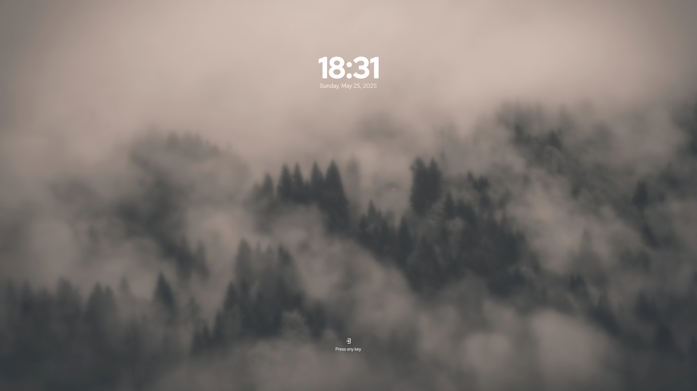

> [!CAUTION]
> UNDER DEVELOPMENT


# Presets

<details>
  <summary>configs/default.conf</summary>
    <p float="left">
      
      
    </p>
</details>>

# Dependencies

- SDDM ≥ 0.20;
- QT ≥ 6.5;
- qt6-svg;
- qt6-virtualkeyboard;

# Installation

Just run the script:

```bash
git clone --depth=1 https://github.com/uiriansan/SilentSDDM && cd SilentSDDM && ./install.sh | bash
```

## Manual installation

### 1. Install dependencies:

#### Arch Linux

```bash
sudo pacman -S --needed sddm qt6-svg qt6-virtualkeyboard
```

#### Debian

```bash
sudo apt-get install sddm qt6-svg qt6-virtualkeyboard
```

#### Void Linux

```bash
sudo xbps-install sddm qt6-svg qt6-virtualkeyboard
```

#### Fedora

```bash
sudo dnf install sddm qt6-qtsvg qt6-qtvirtualkeyboard
```

#### OpenSUSE

```bash
sudo zypper install sddm-qt6 libQt6Svg6 qt6-virtualkeyboard qt6-virtualkeyboard-imports
```

# Customizing

The premade configs are located in `./configs/`. To change the active config, edit the `./metadata.desktop` file and replace the `ConfigFile=` option's value.

You can also create a new config file. There's a detailed guide in addition to the available options in the [wiki](https://github.com/uiriansan/SilentSDDM/wiki/Customizing).

# Acknowledgements

- [Match-Yang/sddm-deepin](https://github.com/Match-Yang/sddm-deepin): code reference;
- [Keyitdev/sddm-astronaut-theme](https://github.com/Keyitdev/sddm-astronaut-theme): code reference;
- [Joyston Judah](https://www.pexels.com/photo/white-and-black-mountain-wallpaper-933054/): background;
- [iconify.design](https://iconify.design/): icons

I couldn't find the source for some of the images used here. [E-mail me](mailto:uiriansan@gmail.com?subject=Background%20image%20in%20SilentSDDM) if you are the creator and want it removed or acknowledged.
